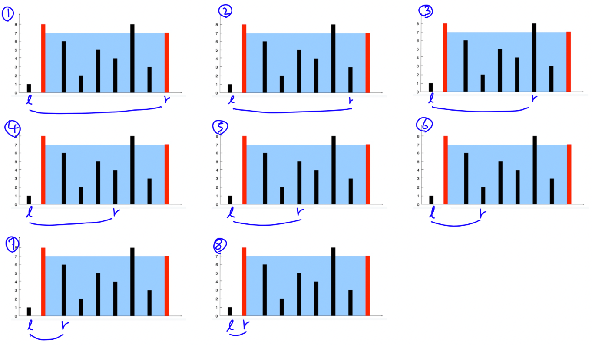
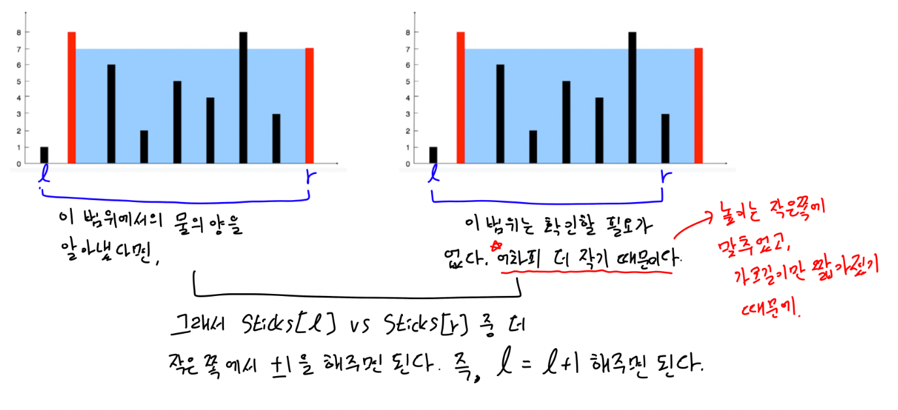

# Container With Most Water
## 문제
[Leetcode - 11. Container With Most Water](https://leetcode.com/problems/container-with-most-water/)

## 풀이
- 넓이는 `두 막대의 위치의 차이 * 두 막대중 작은 막대의 높이`로 한번에 구할 수 있다.
- 모든 경우를 다 살펴봐도 되는데, 시간이 너무 오래걸린다.

- 최대를 구하는것이기 때문에 좌우에서 조금씩 쫍혀가도 된다.

## 코드
[answer.js](./answer.js)