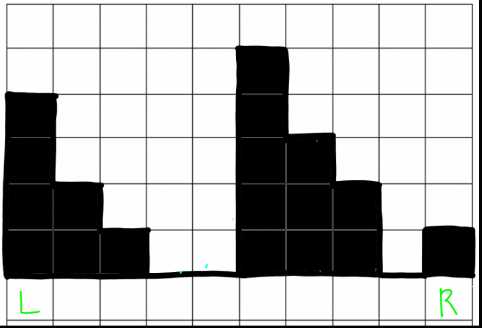

# Trapping Rain Water
## 문제
[Leetcode - 42. Trapping Rain Water](https://leetcode.com/problems/trapping-rain-water/)

## 풀이
- 핵심 : 왼쪽이 따악 버티고 있으면 오른쪽 포인터를 줄이면 되고, 오른쪽이 따악 버티고 있으면 왼쪽 포인터를 줄이면 된다

## 코드
[answer-1.js](./answer-1.js) -> 세로로 물을 체우는 방식 (모범답안)
[answer-2.js](./answer-2.js) -> 가로로 물을 체우는 방식 (실험)